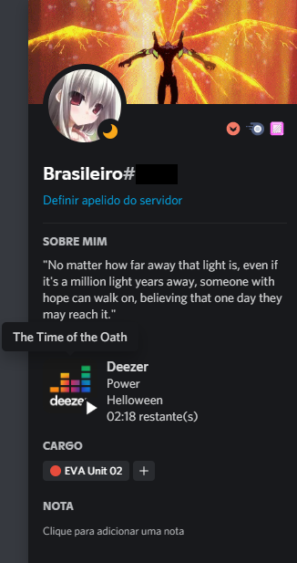

# DeezerRPC
Deezer integrated with the Discord Rich Presence.

This project is not supported and created by Deezer.

This application opens the web version of the Deezer application and performs background operations to collect data from the current song. It does not use the Deezer API, everything is collected from the DOM itself.

Shows status on Discord and also supports global media keys.

I don't understand why Deezer hasn't implemented this until today...

  

