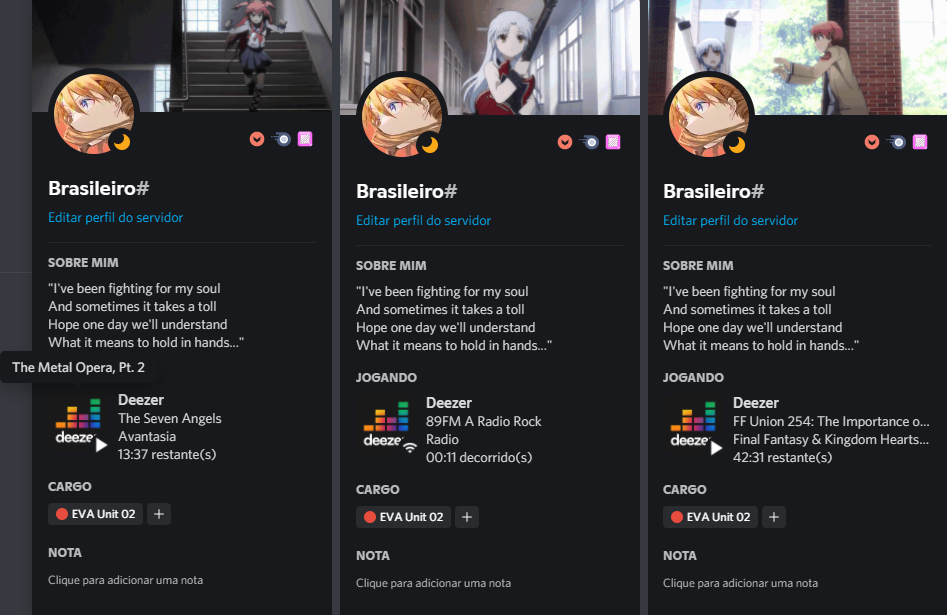

# This project is no longer actively maintained.
## The Discord Developer Application will stay the way it is, for those who will continue to use the current application.

This project started as a way for me to learn TypeScript at the time and also out of frustration because Deezer didn't have an integration with Discord like Spotify.

It looks like Deezer will never implement an official integration and this is really disheartening.

As I said above this project was a way for me to learn TypeScript at the time so the code must not be one of the best.

I will leave the project as a public archive. Anyone who wants to clone and improve the project feel free.

Sorry to be leaving the project, but I really don't feel very excited about working on it.

## Thanks for everything!

# DeezerRPC

Deezer integrated with the Discord Rich Presence.

This project is not supported and created by Deezer.

This application opens the web version of the Deezer application and performs background operations to collect data from the current song. It does not use the Deezer API, everything is collected from the DOM itself.

Shows status on Discord and also supports global media keys.

Supports songs (including ones that user upload), radios and podcasts.

I don't understand why Deezer hasn't implemented this until today...

# Installation
1. Download the correct release for your operating system. (**exe** = Windows, **dmg** = MacOS, **AppImage** = Linux)
2. Install the application that you have downloaded.

# Usage
When opening the app for the first time, you will have to login with your Deezer account. **IT'S THE OFFICIAL DEEZER PAGE, THIS APPLICATION NOT COLLECT ANY DATA FROM THE USERS.**

Discord needs to be running for rich presence to work, otherwise you will have to reopen the application.

Update of rich presence is automatic, does not require any user action.

This application has some options in the system notification area:
* **Toogle**: Shows or hides the DeezerRPC window.
* **Player**: Manually control basic player actions outside main window.
* **Settings**: Miscellaneous options like controlling how the window is minimized and checking for updates on startup.
* **Check for updates**: Check if there is a new version available.
* **DeezerRPC [version]**: Open this GitHub page.
* **Exit**: Closes the application.

# Global Shortcuts
This application has some global shortcuts (check on your keyboard).

* **PLAY**: Play or pause the current song.

* **NEXT**: Go to the next song.

* **PREVIOUS**: Go to the previous song.

# Showcase

  

